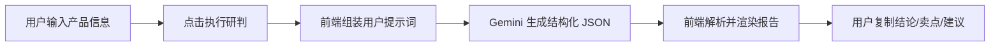
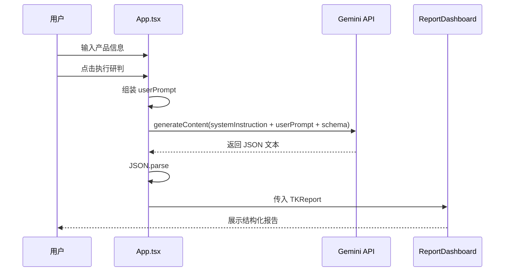

# 设计文档

## 1. 设计目标

`TK选品指挥舱` 的设计目标不是做一个聊天机器人页面，而是做一个“选品决策台”。界面和交互都应当服务于一个核心任务：让用户快速输入关键信息，并获得可直接用于业务讨论的结构化结论。

## 2. 当前设计原则

1. 强调决策感，而不是陪聊感。
2. 强调结构化结果，而不是一大段自然语言。
3. 强调 TikTok 电商场景，而不是泛 AI 工具风格。
4. 强调结论与风险显式呈现，避免信息埋没。

## 3. 当前信息架构

页面采用左右双栏结构：

| 区域 | 作用 |
| --- | --- |
| 顶部导航 | 显示品牌、产品定位和 API 设置入口 |
| 左侧输入区 | 收集选品所需信息并触发分析 |
| 右侧输出区 | 展示结构化报告、加载态和空状态 |

## 4. 当前交互流程

## 5. 当前界面结构说明

### 5.1 顶部导航

当前导航包含以下元素：

1. 产品标识 `TK SCOUT / V1.0`
2. 产品副标题 `TikTok 电商选品决策中心`
3. `API 设置` 按钮
4. 品牌缩写头像

设计意图：顶部区域传递“指挥舱”“司令部”“决策台”的气质，而不是轻量聊天应用。

### 5.2 左侧输入区

输入区当前包含以下字段：

1. 产品名称/型号
2. 大类目
3. 终端售价带
4. 核心卖点描述
5. 使用场景与人群
6. 其他背景信息

设计意图：

1. 输入字段围绕选品判断而非商品上架信息设计。
2. 保持轻量，避免首次使用时门槛过高。
3. 支持信息不完整时先得到初判。

### 5.3 右侧报告区

报告区当前由 5 个主要模块组成：

| 模块 | 目的 |
| --- | --- |
| 司令部研判结论 | 先给业务拍板信息 |
| TK生态适配分析 | 展示关键维度判断，方便解释原因 |
| 最佳成交路径 | 告诉团队“该怎么卖” |
| 提炼核心卖点 | 帮内容团队快速进入素材阶段 |
| 阶段性行动建议 | 给下一步动作，而不是停在分析 |

如果信息不足，还会显示“评估降级警告”。

## 6. 视觉设计说明

### 6.1 当前视觉方向

1. 使用深色背景，突出控制台、监控台和决策中心的氛围。
2. 使用绿色高亮，传递“信号、状态、通过、执行”的感觉。
3. 使用细边框、栅格背景和大写英文标签，强化专业感。

### 6.2 当前主题变量

当前在 `src/index.css` 中定义了以下主题变量：

| 变量 | 含义 |
| --- | --- |
| `--color-tk-cyan` | 绿色高亮色 |
| `--color-tk-pink` | 实际也是绿色系主色 |
| `--color-tk-dark` | 深色背景 |
| `--color-tk-gray` | 卡片背景 |
| `--color-tk-border` | 边框色 |

说明：变量命名中保留了 `cyan/pink`，但实际值已经改成绿色系，后续建议统一命名，减少维护混淆。

## 7. 状态设计

当前页面存在 4 类关键状态：

| 状态 | 表现 |
| --- | --- |
| 空状态 | 提示用户先填写产品信息 |
| 加载状态 | 转圈 + 正在评估文案 |
| 成功状态 | 展示结构化报告 |
| 错误状态 | 在左侧底部展示错误信息 |

## 8. 技术设计

### 8.1 当前组件划分

| 组件 | 责任 |
| --- | --- |
| `App` | 状态管理、表单输入、请求发起、错误处理 |
| `APIKeyModal` | API Key 配置与保存 |
| `ReportDashboard` | 报告渲染、复制交互、不同展示状态 |

### 8.2 当前数据流

### 8.3 当前状态模型

`App.tsx` 维护以下核心状态：

| 状态 | 作用 |
| --- | --- |
| `formData` | 用户输入 |
| `report` | AI 返回的结构化报告 |
| `isLoading` | 控制加载态与按钮禁用 |
| `error` | 记录请求或解析错误 |
| `isSettingsOpen` | 控制 API 配置弹窗 |
| `apiKey` | 当前可用的 API Key |

## 9. 当前设计上的薄弱点

1. 没有历史记录，结果是一次性的。
2. 没有输入模板，用户不一定知道该如何填写更高质量信息。
3. 没有“为什么这样判”的更深层解释区。
4. 没有区分个人判断与团队结论，协作场景偏弱。
5. 前端直连模型，设计上难以支持权限、审计和团队管理。

## 10. 建议的后续设计演进

### 10.1 产品交互层

1. 增加“示例输入”和“优秀输入模板”。
2. 增加“重新分析”和“保存为报告”。
3. 增加“复制为会议纪要格式”“复制为达人 brief 格式”。

### 10.2 信息架构层

1. 增加“历史报告列表”。
2. 增加“风险卡片”，单独列出合规、退货、侵权等风险。
3. 增加“反对立项原因”模块，帮助快速止损。

### 10.3 技术架构层

1. 增加后端代理层。
2. 将提示词与规则配置从前端代码中抽离。
3. 将报告数据入库，支持检索、复盘和统计。

## 11. 设计结论

当前设计已经完成了“单次 AI 研判工具”的核心闭环，适合验证业务价值。下一阶段的重点不应只是继续美化页面，而应优先补齐输入质量、结果沉淀和团队协作这三类能力。
